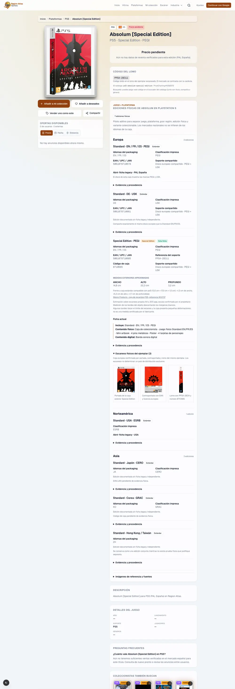
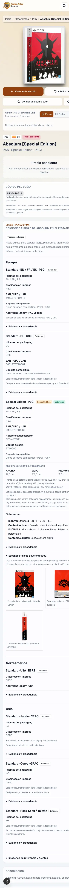

# Catálogo físico v2: arquitectura y piloto Absolum PS5

Fecha de corte: 2026-09-12
Base Git: `565ed255a4e9bb12ccefc82cd8eac7d12225a997`

## Alcance

Esta fase añade una capa reversible para representar:

`Juego + plataforma -> gran región -> edición física -> variante coleccionable -> identidad de precio`

No migra masivamente el catálogo, no cambia IDs o URLs, no reescribe `PAL España`, no modifica collectors y no duplica compañías ni plataformas. Solo el guide v2 de Absolum activa la agrupación nueva; el resto del catálogo continúa en el lector legacy.

## Snapshot previo

- `data/catalog.json`: 81.425 filas y 81.425 IDs únicos.
- `data/index/companies.json`: 5.905 compañías.
- `data/catalog-edition-guides.json`: un guide schema v1.
- `data/catalog-owned-scans.json`: 25 sets de escaneos.
- Blob de catálogo, base y worktree: `52a2399c4960ac95c8e06f17aaadac93aed61b8b`.
- Blob de compañías, base y worktree: `662c9df4c433b0e1a66323f00179aa299b438e41`.

El piloto añade un guide v2 y un set de escaneos de la caja de Absolum Special Edition. `data/catalog.json` y `data/index/companies.json` conservan exactamente sus blobs de la base.

## Arquitectura encontrada

- `src/lib/catalog.ts` mantiene el catálogo y las identidades públicas.
- `src/lib/catalog-list-game.ts` genera el DTO rico de exploración; `src/lib/catalog-card-game.ts`, el DTO de tarjeta.
- `src/lib/catalog-filters.ts` concentra búsqueda, filtros y ordenación.
- `src/lib/public-catalog-initial-page.ts`, `/catalogo`, `/plataforma/[slug]` y sus dos APIs paginan el mismo modelo.
- `src/lib/price-display.ts` y `src/components/game-card.tsx` presentan condiciones y precios.
- `src/lib/catalog-edition-guides.ts` era un lector directo de un único formato y `CatalogEditionGuide` lo mostraba en detalle.
- `src/lib/catalog-owned-scans.ts` exige coincidencia exacta de ID, slug, plataforma, región y edición; los scans alimentan detalle y referencias sin propagarse por título.

También se revisaron los importadores de owned scans. Siguen escribiendo el registro legacy y no se modifican en esta fase.

## Diseño v2

`data/schemas/catalog-edition-guides-v2.schema.json` admite conjuntamente:

- guides v1 sin cambios;
- guides v2 con `game`, `physicalEditions`, `variants`, `sharedDiscs`, `evidence`, referencias a scans y relaciones de contenido.

El adaptador `catalog-edition-guides.ts` normaliza ambos formatos y valida en runtime:

- IDs de edición, variante, disco e identidad de precio únicos;
- `catalogId` público y perteneciente a la plataforma declarada;
- identidad exacta antes de enlazar una ficha;
- referencias existentes a edición, variante, disco, imagen, evidencia y scan set;
- procedencia explícita en imágenes v2.

Las evidencias fuertes para definir una variante física son `REAL_SCAN`, `REAL_PHOTO`, `UNBOXING_FRAME` y `RETAILER_PHOTO_CONFIRMED`. Assets, mockups, imágenes previas, documentación textual y confirmaciones se conservan con su tipo, pero no se convierten automáticamente en prueba visual.

## Compatibilidad y rollback

- Los guides v1 se adaptan en memoria al modelo común y conservan sus enlaces e imágenes.
- Solo `schemaVersion: 2` participa en la agrupación de listados.
- Agrupar elimina duplicados únicamente del DTO de exploración; no elimina filas del catálogo.
- Toda ficha enlazada mantiene su `catalogId`, slug y ruta directa.
- Retirar el guide v2 devuelve inmediatamente el listado legacy, sin migración inversa.
- Los scans se referencian por ID y no se duplican dentro del guide.

## Piloto Absolum PS5

El guide `absolum-ps5` contiene siete ediciones:

| Gran región | Edición | Identificador físico |
| --- | --- | --- |
| Europa | Standard EN/FR/ES, PEGI | EAN `5061078710678` |
| Europa | Standard DE, USK | EAN `5061078710661` |
| Europa | Special Edition, PEGI | EAN `5061078710685` |
| Norteamérica | Standard USA, ESRB | ficha legacy USA |
| Asia | Standard Japón, CERO | pendiente de EAN físico |
| Asia | Standard Corea, GRAC | pendiente de código físico |
| Asia | Standard Hong Kong/Taiwán | conjunta hasta evidencia de separación |

Las tres ediciones europeas apuntan al mismo `sharedDiscId`. La identidad común del disco fue confirmada físicamente por el propietario: incluye la Standard EN/FR/ES distribuida en Francia, Reino Unido y España, la Standard alemana y la Standard contenida en la Special.

La Special referencia la Standard EN/FR/ES mediante `includesEditionIds` y su ficha oficial documenta caja, juego Standard, mini artbook, cuatro pins, póster, cuatro tarjetas y banda sonora digital. Los scans propios acreditan por separado caja, EAN, PEGI, PPSA y lomo; no se usan para afirmar el contenido interior.

### Medidas de la caja Special

- ANCHO: 14,8 cm.
- ALTO: 22,3 cm.
- PROFUNDO: 3,2 cm.

Son estimaciones de los bordes del objeto en escaneos A4 a 300 ppp, con escala confirmada por el propietario. La anchura observada varía entre 148,1 y 148,9 mm y el lomo mide aproximadamente 31,6 mm. Algunos bordes coinciden con el límite del escaneo, por lo que no se presentan como medidas certificadas por el fabricante.

Como comparación se usa una caja de recambio compatible con PS5 documentada por Walvis Products: 13,5 cm de ancho, 17,0 cm de alto y 1,5 cm de profundidad. Por tanto, la caja de Absolum mide aproximadamente 1,3 cm más de ancho, 5,3 cm más de alto y 1,7 cm más de profundidad. Es una referencia comercial de formato, no una especificación oficial de Sony.

Las medidas ya obtenidas de Metal Gear Solid Delta Deluxe, The Coma: Recut Limited Edition, Touhou Luna Nights 5-Year Anniversary Limited Edition, Ninja Gaiden: Ragebound Special Edition y Blasphemous II Collector's Edition se conservan en `data/research/owned-scans/2026-09-12-pending-special-edition-measurements.json` como investigación preparada. Esta fase no las publica ni crea guides v2 para esas cajas, porque el piloto funcional autorizado se limita a Absolum. La portada de Blasphemous II queda bloqueada para publicación hasta repetir el escaneo con margen suficiente.

## Navegación, filtros y precios

- El catálogo y PS5 muestran una sola tarjeta `Absolum` para las tres fichas legacy enlazadas.
- La tarjeta resume siete ediciones y sus tres grandes regiones.
- Los filtros `Gran región`, `Rating` y `Edición física` evalúan los hijos y devuelven una sola raíz.
- La búsqueda incluye EAN, referencias, idiomas, ratings y marcas de variantes.
- Para el grupo óptico se muestran únicamente `Completo` y `Precintado`; si hay varios valores, se muestra rango. No se inventan precios.
- Un fixture conceptual de Resident Evil 4 demuestra que SIAE/no-SIAE comparte edición, caja, EAN y disco, pero conserva dos `priceIdentity`.

## Evidencia y fuentes

- Escaneos propios: `data/catalog-owned-scans.json` y manifiesto SHA-256 `data/research/owned-scans/2026-09-12-absolum-special-edition-assets.json`.
- Contenido oficial: Silver Lining Direct y Tesura Games.
- Comparación de caja estándar: Walvis Products, referencia 900737.
- Los datos asiáticos sin identificador confirmado quedan vacíos; no se completan por heurística.

## QA visual

Detalle de Absolum Special Edition con la jerarquía completa en escritorio:

La misma ficha a 390 px, sin overflow horizontal:

Se comprobaron `/catalogo?q=Absolum`, `/plataforma/ps5?q=Absolum`, la ficha Standard PAL España, la ficha Special PAL España y la ficha USA. Todas respondieron `200`. Catálogo y PS5 mostraron una sola tarjeta raíz; las dos fichas directas conservaron sus URLs. En 1440 px y 390 px no hubo overflow horizontal, imágenes rotas, errores de consola, respuestas HTTP fallidas ni recursos con estado 4xx/5xx.

## Riesgos y deuda explícita

- Esta fase no añade un editor Admin para guides v2.
- Las ediciones asiáticas sin ficha legacy no tienen aún URL individual; viven dentro de la ficha agrupada.
- `priceIdentity` prepara cotizaciones por variante, pero los collectors aún no publican precios en ese nivel.
- El estado de colección y los anuncios siguen ligados a `catalogId`; su agregación por todas las ediciones deberá diseñarse antes de migrar familias de forma masiva.
- Los filtros nuevos son útiles para el piloto; su cobertura seguirá siendo parcial mientras el resto continúe en v1.
- No se infieren países de distribución a partir de idioma, tienda, vendedor o capacidad de envío.

## Controles de aceptación

- JSON y schema parseables: PASS.
- Pruebas específicas v1/v2, scans, evidencia, disco compartido, filtros, URLs, precios ópticos y SIAE: 8/8 PASS.
- Suite unitaria completa: PASS, incluidas 263/263 pruebas principales y todas las suites previas/posteriores.
- `typecheck`: PASS.
- Lint: PASS, 0 errores y 34 avisos preexistentes.
- Build Next.js: PASS, 139 rutas estáticas generadas.
- QA visual móvil/escritorio de catálogo, plataforma PS5, ficha Standard y ficha Special: PASS.
- Comparación final de blobs y conteos contra la base: PASS.

No se autoriza una migración masiva, fusión ni despliegue como parte de esta fase.
